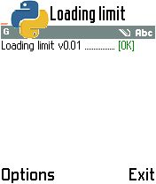
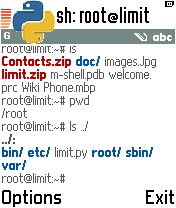
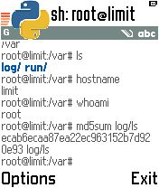
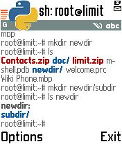

Limit versi 0.01 beta
---------------------
Limit adalah sebuah program simulasi Unix Terminal sederhana serupa PyUnix. Tujuan penulisanya adalah agar ponsel ponsel Symbian v1 dapat juga memiliki dan menjalankan program mirip PyUnix. Walaupun target penulisan ditujukan untuk ponsel Symbian v1, limit juga dapat di pasang dan dijalankan pada ponsel Symbian v2 (hanya pernah dicoba pada ponsel 6600).

Pada versi ini, limit hanya membawa beberapa perintah dasar saja yang tidak disertai dengan parameter yang lengkap.

Oleh: cupucupu <cupu.cupuh@yahoo.co.id>

Info: [Limit Publikasi Awal](http://sites.google.com/site/cuputoyz/limit)

Screenshot
----------
   
